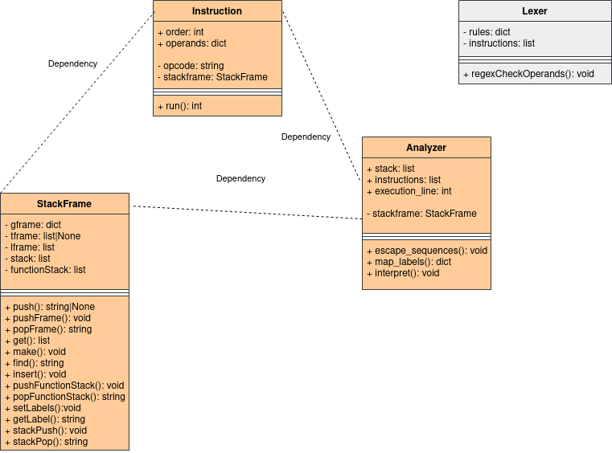

# Implementační dokumentace k 1. úloze do IPP 2022/2023 #
## Jméno a příjmení: Rostislav Král
## Login: xkralr06 ##

***
### Popis průběhu programu ###

Program začíná v skriptu `interpret.py`, kde probíhá parsování argumentů a načtení XML souboru a rozparsují se jednotlivé instrukce, dále je tu inicializována třída `Analyzer`
která načte instrukce a v konstruktoru převede obyčejný `list` na `list` objektů typu třídy `Instruction` , zavolá se metoda na escapování sekvencí a spustí se hlavní metoda programu `interpret()`.
V té začne načítat data ze třídy `StackFrame`, která je její privátní složkou, avšak ještě předtím se namapují labely na pořadí instrukce, aby tak bylo jednodušší kontrolovat průběh programu.
Data jsou brány ze všech operandů typu var na základě rozparsování jejího jména a rámce. Poté přichází na řadu třída `Instruction`, která v sobě nese informace jak realizovat dané instrukce v metodě `run()`.
Třída StackFrame je dalo by se říci, respektive by se dala naimplementovat jako návrhový vzor jedináček jelikož obě třídy `Instruction` a `Analyzer` využívají pouze jednu instanci třídy `StackFrame`, která je vytvořena
ve třídě `Analyzer` a ta ji potom předává třídě `Instruction` takže se jedná "vloženou závilost". Všechny datové složky třídy `StackFrame` jsou privátní a manipuluje se s nimi výhradně přes metody dané třídy. Projekt obsahoval(obsahuje) ještě třídu `Lexer`, bohužel se mi však nepodařilo její chování správně naimplementovat,
měla zajišťovat lexikální část projektu.

### UML Diagram
